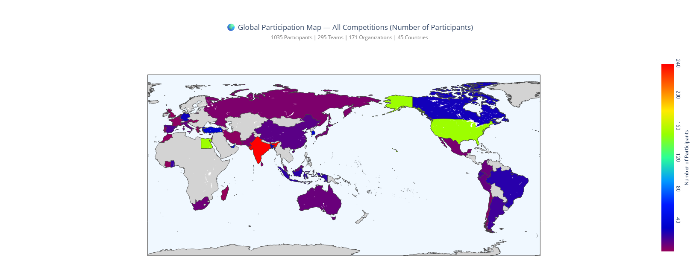
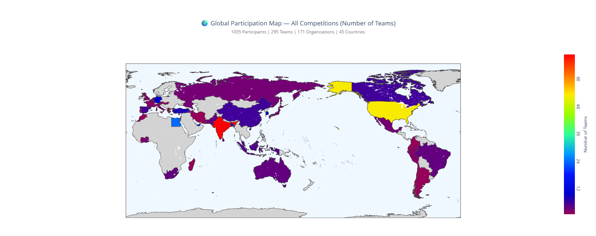
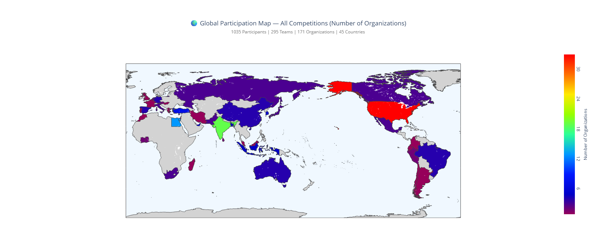
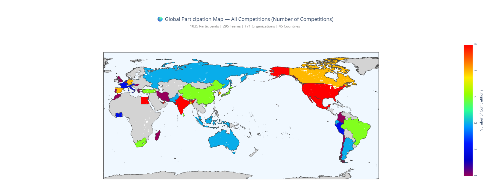

# AutoDRIVE-RoboRacer Sim-Racing Participation
Registration Data and Participant Analysis for RoboRacer Sim Racing Leagues

|  |  |  |  |
|:------------------------------:|:-----------------------:|:-------------------------------:|:------------------------------:|
| **Total Participants**         | **Total Teams**         | **Total Organizations**         | **Total Competitions**         |

| Venue | Global Participation Map | Participating Organizations |
|:-----:|:------------------------:|:---------------------------:|
| [ICRA 2026](https://autodrive-ecosystem.github.io/competitions/roboracer-sim-racing-icra-2026) |  |  |
| [CDC-TF 2025](https://autodrive-ecosystem.github.io/competitions/roboracer-sim-racing-cdc-tf-2025) |  |  |
| [ICRA 2025](https://autodrive-ecosystem.github.io/competitions/roboracer-sim-racing-icra-2025) |  |  |
| [CDC 2024](https://autodrive-ecosystem.github.io/competitions/roboracer-sim-racing-cdc-2024) |  |  |
| [IROS 2024](https://autodrive-ecosystem.github.io/competitions/roboracer-sim-racing-iros-2024) |  |  |
